# EfficientDet
---
## 모델소개 및 선정 이유
- 앞선 모델인 EfficientNet에서의 아이디어를 가져와서 object detection에 적합하게 만든 모델이 EfficientDet.
- __Compound Scaling__ 기법뿐만 아니라 __BiFPN__ 사용.
- 에이모 측에서 받은 이미지의 사이즈가 크기 때문에 파라미터 수를 효과적으로 줄일 수 있는 __BiFRN__ 을 사용하는 EfficientDet이 좋을 듯함.
- Real-Time Object Detection (SOTA) 기준 최상위 모델 YOLOv7과 EfficientDet-D7 성능 차이가 크지 않음.
- 따라서 YOLOv7과 비교하기 좋을 듯함.

----
## 모델링 (tensorflow)
- #### input 파일 생성
   - __official EfficientDet__은 input 파일을 __TFRecord__ 파일로 받음.
   - 따라서 에이모 측에서 받은 어노테이션 데이터(.json)를 TFRecord로 변환.
   - [.json -> TFRecord 파일 변환 코드](https://github.com/minki-kwak/AIFFELTHON/blob/main/%EB%AA%A8%EB%8D%B8%EB%A7%81/Efficientdet/EfficientDet_tensorflow/efficientdet_tensorflow_dataset_making.ipynb)
- #### 모델 빌딩 (EfficientDet-d2)
   - official github에 따르면 pretrained_model을 다운 후 main.py 파일을 실행시켜 학습을 진행.
   
  ``` 
  # 예시 코드
  !python main.py --mode=train_and_eval \  # 학습 모드 설정
  --train_file_pattern=tfrecord/pascal*.tfrecord \  # train_data 경로
  --val_file_pattern=tfrecord/pascal*.tfrecord \  # val_data 경로
  --model_name=efficientdet-d0 \  # 사용할 모델 버전
  --model_dir=/tmp/efficientdet-d0-finetune  \  # 학습된 모델이 저장될 위치
  --ckpt=efficientdet-d0  \  # pretrained_ckpt 위치
  --train_batch_size=64 \  # train 배치 사이즈
  --eval_batch_size=64 \  # val 배치 사이즈
  --num_examples_per_epoch=5717 --num_epochs=50  \  # 1 epochs 시 적용하는 examples 개수  # 총 epochs 수
  --hparams=voc_config.yaml --val_json_file=tfrecord/json_pascal.json  # 하이퍼 파라미터  # val_data json 파일(필요x)
  ``` 
  
   - 하이퍼 파라미터를 .yaml 파일로 줄 수도 있지만 dict로 주는 방법도 존재함.
   - 하지만 두 방법 모두 하이퍼 파라미터를 일부 인식을 못 하는 문제가 존재.
   - 따라서 main.py 파일 내의 필요한 코드만 빼 와서 학습 진행.
   - [학습 진행 코드](https://github.com/minki-kwak/AIFFELTHON/blob/main/%EB%AA%A8%EB%8D%B8%EB%A7%81/Efficientdet/EfficientDet_tensorflow/EfficientDet_tensorflow_aimmo_training.ipynb)
## 학습 결과
- epochs 100으론 mAP가 낮은 것을 확인함.
   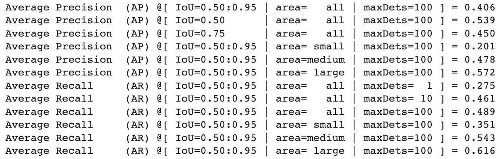
- 학습 결과를 확인해보니 car, truck, bus, pedestrian 중 truck과 bus만 detection한 것을 확인했다.
   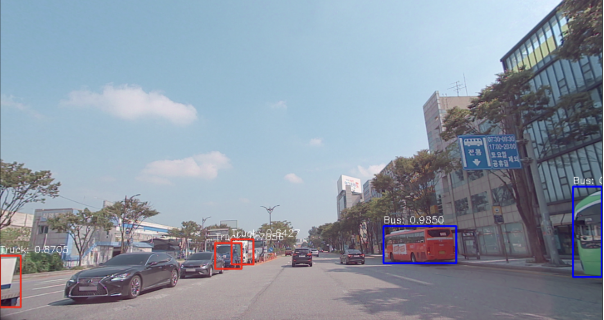
   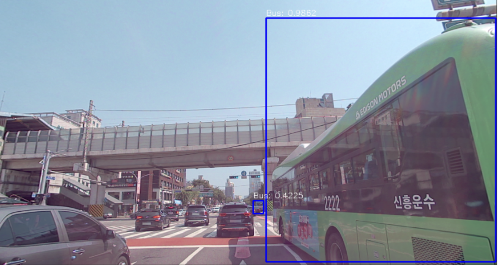
   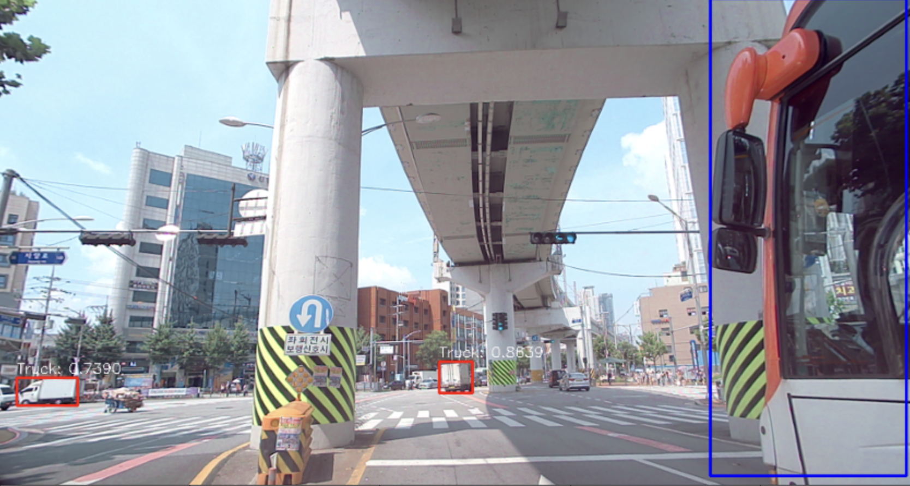
   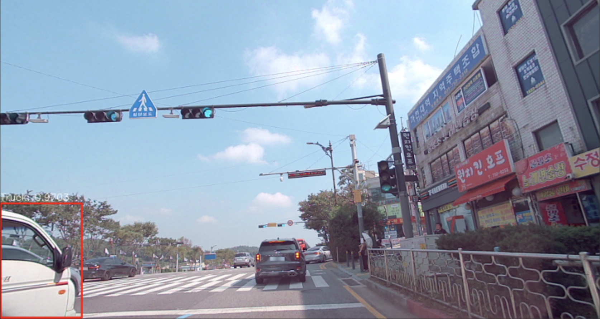
## 문제상황
1. __car, truck, bus, pedestrian 중 truck과 bus만 detection 함.__
  - 데이터를 확인해봤지만, 이상이 없었음.
  - 하이퍼 파라미터 중 num_classes도 4로 되어있었음.
  - mAP 값들을 보면 좋은 값은 아니지만, class 중 가장 객체 수가 많은 car와 pedestrian을 detection 못한 것 치곤 높음.
  - 따라서 모델 학습 중에 모델이 truck, bus만 객체로 학습했다는 뜻.
2. __GCP 환경에서 GPU가 잡히지 않음.__
  - 다른 두 모델에 비해 EfficientDet 모델이 학습 시간이 김. LMS(Tesla T4)에서 D7 기준 1 epoch에 1시간 13분 소요.
  - 따라서 GCP(Tesla V100)에서 돌려야 여유가 생김.
  - 하지만 EfficientDet에서 요구하는 tensorflow 버전과 GCP CUDA 버전이 맞지 않아 GPU가 잡히지 않는 문제 발생.
#### 위와 같은 문제 때문에 pytorch로 구현된 EfficientDet을 사용하기로 결정.
---
## 모델링 (pytorch)
- #### input 파일 생성
  - EfficientDet pytorch는 하나의 .json 파일을 input 파일로 받음.
  - 따라서 하나의 이미지당 하나의 .json 파일을 하나로 압축하는 과정 필요.
  - [.jsons -> .json 변환 코드](https://github.com/minki-kwak/AIFFELTHON/blob/main/%EB%AA%A8%EB%8D%B8%EB%A7%81/Efficientdet/EfficientDet_pytorch/efficientdet_pytorch_dataset_making.ipynb)
- #### 모델 빌딩 (EfficientDet-d0)
  - EfficientDet pytorch는 별도의 과정 없이 train.py 파일을 실행시켜 학습을 진행.

  ```
  python train.py -c 2 \  # EfficientDet 버전
  -p your_project_name \  # 프로젝트 이름
  --batch_size 8 --lr 1e-3 \  # 배치 사이즈  # learning_rate
  --num_epochs 10 \  # epoch 수
  --load_weights /path/to/your/weights/efficientdet-d2.pth \  # pretrained_ckpt 경로 또는 이전 학습의 ckpt
  ...
  ```
  - [학습 진행 코드](https://github.com/minki-kwak/AIFFELTHON/blob/main/%EB%AA%A8%EB%8D%B8%EB%A7%81/Efficientdet/EfficientDet_pytorch/EfficientDet_pytorch_aimmo_training.ipynb)
## 학습 결과
- loss는 이상적으로 떨어지긴 하지만 최종값이 크게 작지는 않음을 확인.
   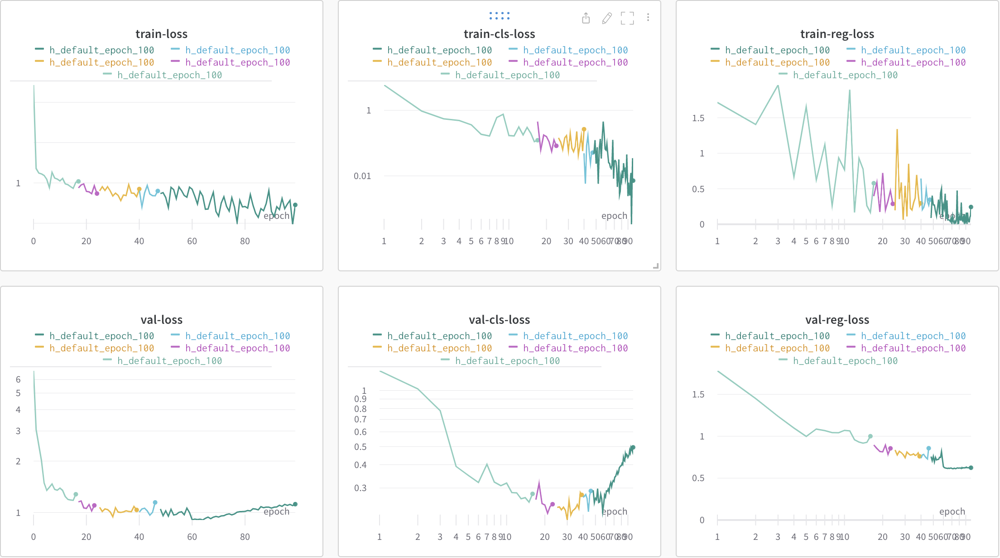
- mAP역시 tensorflow와 비교하여 오히려 안 좋은 것을 확인.
- val_mAP
   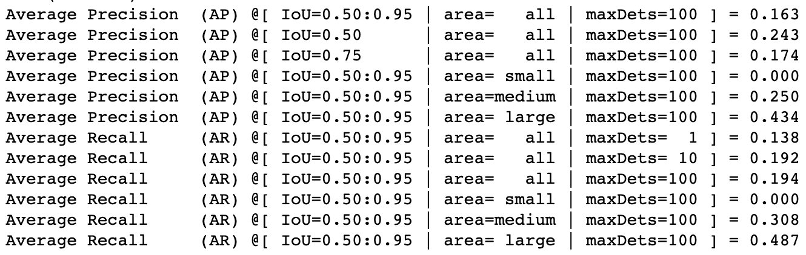
- test_mAP
   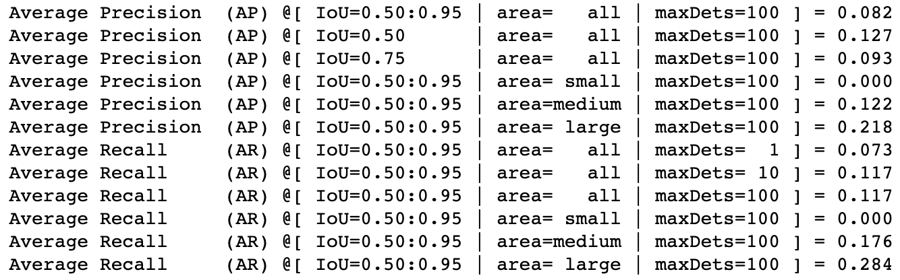
- 학습 결과를 시각화해보니 아예 detection을 잘못하고 있는 것을 확인.
   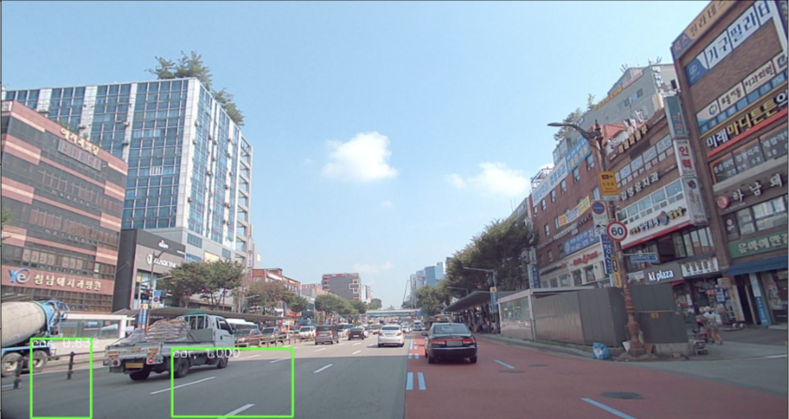
   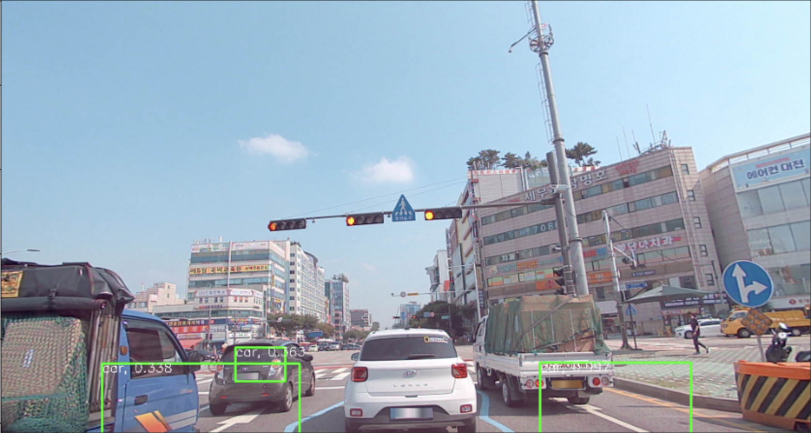
   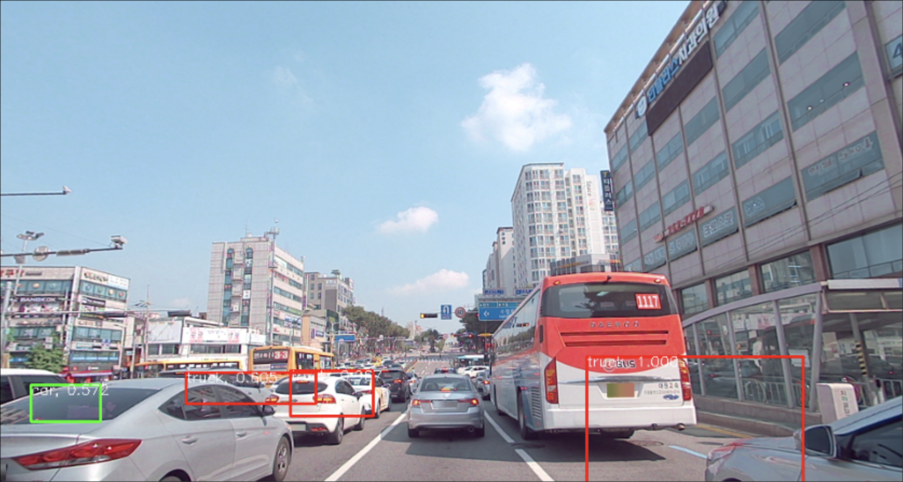
   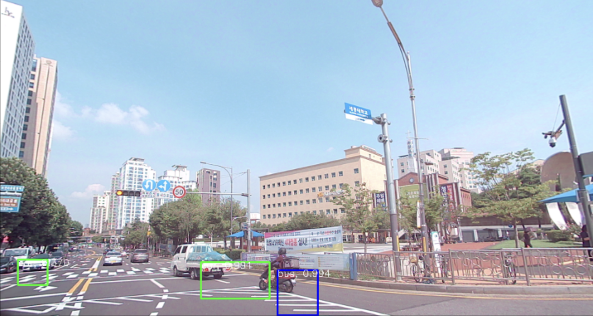
- 데이터를 확인해봤지만, 이상은 없었음.
#### 시간상의 문제와 다른 모델의 문제로 EfficientDet 모델 대신 Faster-RCNN 모델에 집중하기로 함.
---
## 회고
- 처음부터 좀 더 계획적으로 프로젝트를 진행했으면 시간적 여유가 좀 더 있었을 것 같은 후회가 남음.
- 수많은 에러와 시도를 거쳐 모델을 완성했지만 알 수 없는 이유로 결과를 제대로 못 본 게 아쉬움.
- 많은 것이 처음이라서 답답하고 지치기도 했지만 좋은 경험을 한 것 같음.
- 다음에 에이모 측에서 데이터가 오픈된다면 EfficientDet의 결과를 제대로 보고 싶음.  
 
