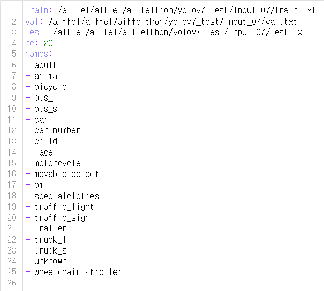
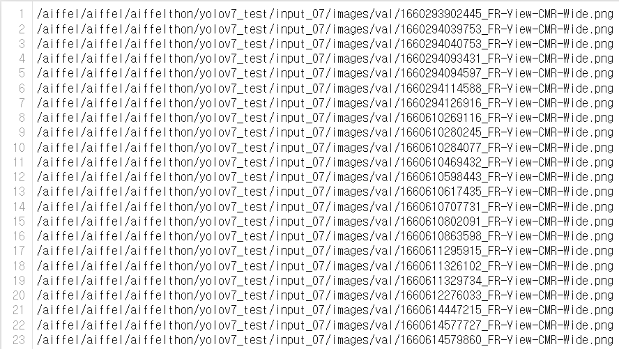
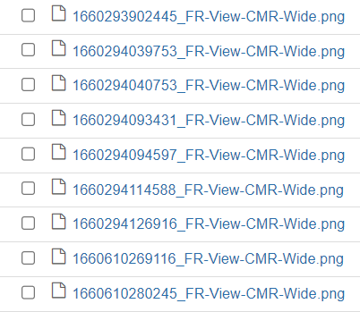
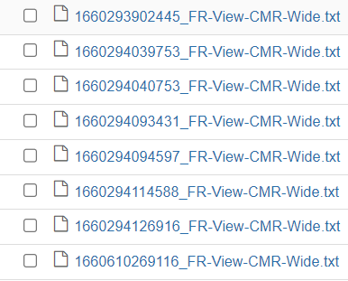
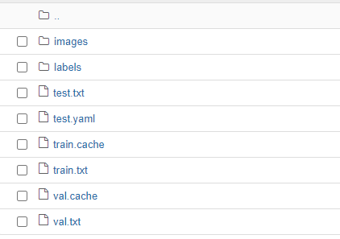

# YOLOv7
---
## 모델소개 및 선정 이유

### 1. 클래스 분류를 회귀 문제로 접근

    - yolo는 클래스분류 문제를 회귀 문제로 접근하여 확률값으로 클래스를 분리함으로써 이분법적인 분류 문제를 해결하였다. 

### 2. 그리드 방식 사용
 
    - 기존의 윈도우 슬라이딩 방식은 객체 탐지성능은 높으나 비용과 시간측면에서 비효율적이었다. yolo는 그리드 방식을 통해 빠르게 객체를 감지하는 방법을 개발 하였다.
    

### 3. 1-stage detector

    - 기존의 객체 감지 방식은 위치를 찾는 과정과 클래스를 분류 하는 과정이 각각 이뤄 졌으나 yolo의 경우 병렬 처리를 통해 두 과정을 한번에 처리 함으로써 탐지 속도를 향상 시켰다.

### 4. 결론 

    - yolo는 객체 탐지속도가 우수하고 정확도도 시리즈가 나오면서 점차 향상 되었기 때문에 자율 주행 객체 탐지에 있어서 적합한 모델이라 판단하였다.

----
## input 파일 생성

### 데이터 구성
    - yolov7의 공식 깃헙을 통해 확인한 결과 coco데이터를 변환하여 학습을 진행한 것을 확인하였다.

    - coco 데이터를 어떤 식으로 변경하였는지 확인 후 해당 코드를 작성하여 input파일을 생성하였다.

    - yaml→ txt→ 이미지,라벨

- yaml : (train.txt, val.txt, test.txt)의 경로, 클래스 수 , 클래스 이름 저장

- txt : images에 있는 이미지의 절대 경로를 저장한 txt파일,train,val,test로 구분

   
- images : (train, val, test)로 구분된 이미지가 들어감

- labels : train,val,test로 구분된 txt 파일이 들어감.

  
- 라벨 txt 파일 내부 (클래스 넘버 , bbox (x,y,h,w))

- input 파일 전체 구조

---
## 학습 
### 1차 : p5 기본 하이퍼파라미터 사용

    - hyperparameters: lr0=0.01, lrf=0.1, momentum=0.937, weight_decay=0.0005, warmup_epochs=3.0, warmup_momentum=0.8, warmup_bias_lr=0.1, box=0.05, cls=0.3, cls_pw=1.0, obj=0.7, obj_pw=1.0, iou_t=0.2, anchor_t=4.0, fl_gamma=0.0, hsv_h=0.015, hsv_s=0.7, hsv_v=0.4, degrees=0.0, translate=0.2, scale=0.9, shear=0.0, perspective=0.0, flipud=0.0, fliplr=0.5, mosaic=1.0, mixup=0.15, copy_paste=0.0, paste_in=0.15, loss_ota=1
    
### 2차 : custom1

    - 먼저 오버슈팅에 대한 실험을 해보았다. 이번실험은 lr-0을 낮춰 오버슈팅을 방지 하는 실험을 진행 하였다.

    - hyperparameters: lr0=0.001

### 3차 : custom2

    - obj _loss 란, 그리그 셀에 객체가 존재하는지 여부에 대한 로스값으로 이값이 수렴하지 못한다는건 객체와 배경에 대한 분리를 못한다고 생각 했고 이번엔 obj 값을 조정해 보았다.  

    - hyperparameters: obj=0.5

### 4차 : custom3

    - 배경학습의 영향을 줄이기 위해 focal_loss를 사용하고 gamma를 1.0로 주었고 옵티마이저를 adam으로 변경해보았다. lr-0을 줄였을때 obj가 수렴하는 양상을 보여서 lr-0도 변경하였다.

    - hyperparameters: lr0=0.001, fl_gamma=1.0
    
### 5차 : custom4

    - 똑같은 값으로 재 실험을 했을때의 변화가 있을지 실험을 해보았다.

    - hyperparameters: lr0=0.001, fl_gamma=1.0
    
### 6차 : custom5

    - 오버 슈팅인지 알아보기 위해 lr0과lrf둘 다 낮췄고 obj를 높여서 실험해 보았다. adam을 사용하였다.

    - hyperparameters: lr0=0.001, lrf=0.01, obj=0.9

### 7차 : custom6

    - 오버 슈팅인지 알아보기 위해 lr0과lrf둘 다 낮췄고 obj를 높여서 실험해 보았다. adam을 사용하였다.

    - hyperparameters: lr0=0.001, lrf=0.01, obj=0.9
    
### 8차 : custom7

    - 오버 슈팅인지 알아보기 위해 lr0과lrf둘 다 낮췄고 obj를 높여서 실험해 보았다. adam을 사용하였다.

    - hyperparameters: lr0=0.001, lrf=0.01, obj=0.9
    
## 최종선정

### 6차 : custom5

- 오버 슈팅인지 알아보기 위해 lr0과lrf둘 다 낮췄고 obj를 높여서 실험해 보았다. adam을 사용하였다.

- hyperparameters: lr0=0.001, lrf=0.01, obj=0.9

   

## 회고
- 데이터는 양과 다양성이 아주 중요한것 같다.
- 수많은 에러와 마주치고 해결하는 과정을 꼼꼼히 정리하지 않은게 아쉽다.
- 시간에 쫓기다 보니 계획을 벗어나는 일이 많아 그나마도 부족한 시간을 제대로 활용하지 못했던것 같다.
- 다음에 기회가 된다면 모델의 전체적인 흐름을 세밀하게 분석하여 모델을 확실히 이해하고 학습에 임하고 싶다.

